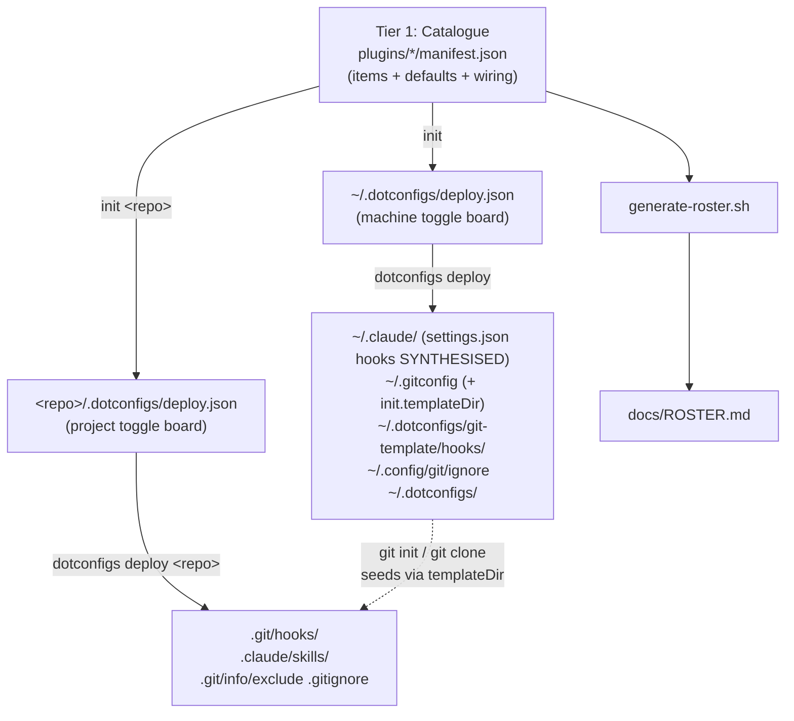

# Architecture

[← docs](../README.md#documentation) · Explanation

How dotconfigs is wired: a two-tier model (catalogue → per-instance toggle board), everything else derived, and a per-file ownership model that lets it share directories with other tools safely.

## Two tiers

dotconfigs separates **what exists** from **what's deployed here**:

- **Tier 1 - `plugins/*/manifest.json` (the catalogue).** Each plugin's manifest lists every item it offers, fully specifying how and where each deploys (`source`, `method`, `target`, optional `wiring`) and its `default` on/off state. Version-controlled, identical on every machine. See [Manifest format](manifest.md).
- **Tier 2 - `deploy.json` (the toggle board).** A per-instance file *outside* the repo, mirroring the catalogue as a `plugin → category → item → bool` map, seeded from each item's `default`. **This is the single place to say what's deployed on this instance.** Flip an item `true`/`false` and re-run `deploy`. Machine selection lives at `~/.dotconfigs/deploy.json`; per-project at `<repo>/.dotconfigs/deploy.json`.

Everything else derives from these:

- **`generate-roster.sh`** reads the manifests (hook list + descriptions + Event/Matcher from each item's `wiring`; skill descriptions from `SKILL.md` frontmatter) to produce [ROSTER.md](ROSTER.md).
- The tool-owned end files (`~/.claude/settings.json`, `~/.gitconfig`, `.git/info/exclude`, …) are written by `deploy` from the selected items.



### Catalogue vs selection

These are easy to conflate but operate at different stages:

- **`plugins/*/manifest.json` (the catalogue)** - declares everything a plugin *can* deploy. Committed, identical on every machine. Read at `init` time to seed defaults, and again at `deploy` time to resolve each selected item to its `source`/`method`/`target`.
- **`deploy.json` (the selection)** - a name→bool map seeded from the catalogue by `init`, then *edited by you* to toggle the subset that actually deploys. Local, kept out of git (the machine file lives in `~/.dotconfigs/`; the project file is added to the repo's `.git/info/exclude`). To stop deploying something, flip it `false` here - editing the manifest alone changes nothing on this instance until you re-`init`.

Scope is **implied by the target path**, not declared separately: machine-scope items (`~/...` / absolute targets) live in the machine file, project-scope items (relative targets) in the project file. An item with **both** kinds of target - git hooks (`~/.dotconfigs/git-template/hooks/...` *and* `.git/hooks/...`) and claude skills (`~/.claude/skills/...` *and* `.claude/skills/...`) - appears in both files, and each deploy applies only its scope-matching target.

## Data flow

```
  First-time setup
  ─────────────────────────────────────────────────────────────────
  1. dotconfigs setup     creates PATH symlinks (dotconfigs, dots)
  2. dotconfigs init      seeds ~/.dotconfigs/deploy.json from the manifests
  3. (optional) edit ~/.dotconfigs/deploy.json to toggle items off
  4. dotconfigs deploy    deploys each enabled item to its target; tears down
                          disabled ones; synthesises ~/.claude/settings.json's
                          hooks block from the enabled, wired Claude hooks;
                          reconciles git init.templateDir so every new git
                          init/clone auto-seeds the git hooks

  Per-project setup  (for repos that existed before the machine deploy)
  ─────────────────────────────────────────────────────────────────
  5. dotconfigs init <path>     seeds <repo>/.dotconfigs/deploy.json; excludes it from git
  6. (optional) edit it, e.g. set "pre-commit": false for this repo
  7. dotconfigs deploy <path>   deploys the project selection into the repo;
                                records <path> in ~/.dotconfigs/projects.list for audit
  8. dotconfigs status          audits deployed repos for missing/dangling git hooks
```

Commands and flags in full: [Commands](commands.md).

## Hook activation: Claude vs git

A deployed hook *file* does nothing until something tells its host tool to run it. The two tools dotconfigs manages **activate hooks completely differently**, and the model mirrors that.

| | **Claude Code hooks** | **git hooks** |
|---|---|---|
| What activates a hook | a `hooks` block in `~/.claude/settings.json` | the file's mere presence in a repo's `.git/hooks/` |
| Machine-wide config? | **Yes** - `~/.claude/settings.json` fires in every directory | **No** - git consults no global hook dir by default |
| How dotconfigs wires it | `settings.json` `hooks` block **synthesised** from selected hooks' `wiring` | symlinked into the template dir (new repos) and per-repo `.git/hooks/` |

Consequences baked into the design:

- **Claude hooks are wired once, machine-wide, with no static block to maintain.** `plugins/claude/settings.json` carries no `hooks` block. On every machine `deploy`, dotconfigs reads the `wiring` of each **enabled** Claude hook, groups it by event then matcher, and synthesises the `hooks` block straight into the merged `~/.claude/settings.json`. A hook is wired *iff* it is selected - deselect one in `deploy.json` and it's neither symlinked into `~/.claude/hooks/` nor referenced from `settings.json`, so there is never a dangling command and never a hand-maintained wiring to drift. The user-scope `settings.json` is the single activation point, so guards protect every directory, even non-repos.
- **git deploy seeds, it does not enforce.** Because git has no machine-wide hook directory, the git hooks' machine target only populates the **template dir** (`~/.dotconfigs/git-template/hooks/`); git copies those (symlinks preserved → they auto-update) into every new `git init`/`clone`. Pre-existing repos are covered by a project `deploy <repo>`, which installs into that repo's `.git/hooks/`. `init.templateDir` is **coupled to the git hooks**: a machine `deploy` sets it when any git hook is selected and unsets it (only if it's still dotconfigs' value) when none are - so turning seeding off is just toggling the git hooks off in `deploy.json`, with no orphaned config. `dotconfigs status` audits the registry of project-deployed repos (`~/.dotconfigs/projects.list`) for hooks that have gone missing or dangling.

## Symlink ownership

dotconfigs tracks ownership **per file** (not per directory) by resolving each target. This is what lets it live safely in shared directories like `~/.claude/` alongside files other tools create.

```
  ~/.claude/
  ├── hooks/
  │   ├── block-rm-rf-root.sh  ──→ dotconfigs/plugins/claude/hooks/...  (ours)
  │   └── some-other-hook.sh   ──→ /other/tool/...               (foreign, untouched)
  └── skills/
      ├── commit/              ──→ dotconfigs/plugins/claude/skills/... (ours)
      └── other-skill/         ──→ /other/tool/...               (foreign, untouched)
```

Deploy only touches files it owns (symlinks resolving back into the dotconfigs repo). Foreign files are never overwritten without prompting. Files that an application *writes into* (like Claude Code's `settings.json`) are a special case handled by the `merge` method rather than symlinking - see [Deploy methods](deploy-methods.md).

## Engine vs data

The repo splits the engine from the registry:

- **`src/`** - the engine: `src/dotconfigs` (the entry point; it follows its PATH symlink to find the repo root, the parent of `src/`) and `src/lib/*.sh` (sourced libraries, no shebangs).
- **`plugins/{claude,git,shell}/`** - the data: a `manifest.json` per plugin plus the source files it catalogues.
- **`scripts/`** (`generate-roster.sh`, `build-claude-plugin.sh`), **`docs/`**, **`tests/`**.

## Why a clone, not a package

dotconfigs deploys symlinks that point **into the repo**, and you edit those files and commit them. That requires the repo to live on disk as an editable git clone (the same model as GNU Stow, chezmoi, yadm) - it is intentionally not a `pip`/`uv`-installed package.

## Related

- [Deploy methods](deploy-methods.md) - the four methods and when each applies.
- [Manifest format](manifest.md) - the schema the dataflow is built on.
- [Commands](commands.md) - the verbs that drive the flow.
