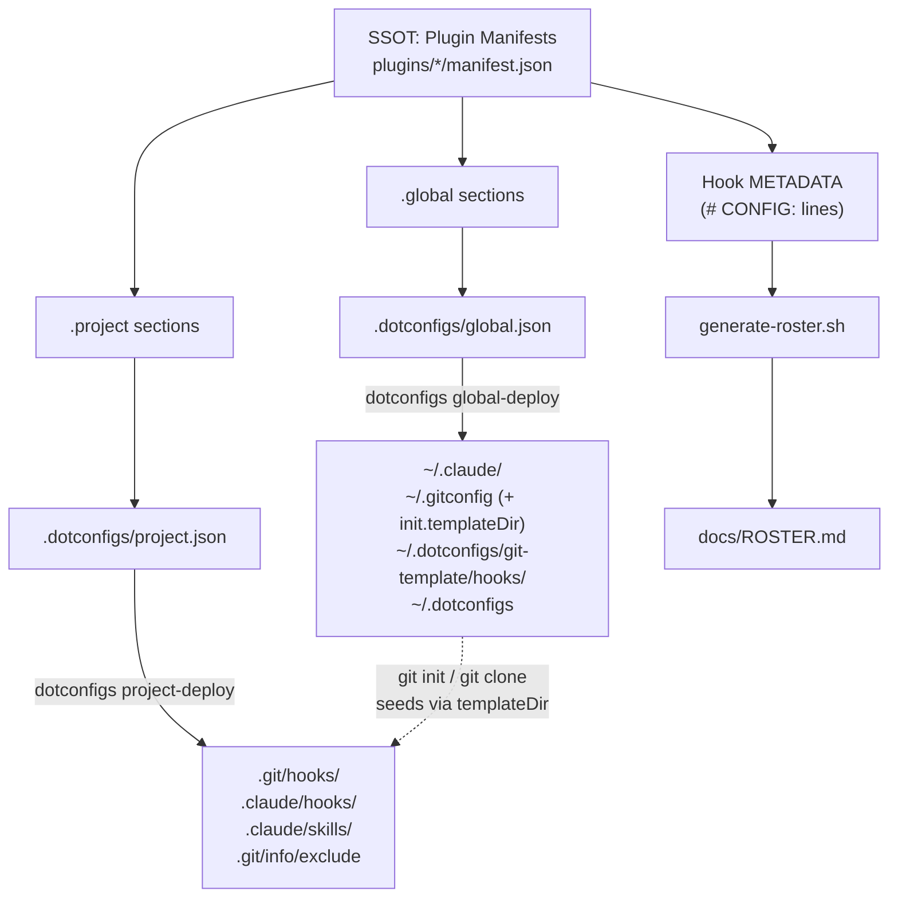

# Architecture

[← docs](../README.md#documentation) · Explanation

How dotconfigs is wired: one source of truth (plugin manifests), everything else derived, and a per-file ownership model that lets it share directories with other tools safely.

## Single source of truth

Plugin manifests (`plugins/*/manifest.json`) declare all available functionality - what files exist and where they deploy. Everything downstream derives from them:

- **Manifests** - the upstream SSOT for each plugin.
- **`.dotconfigs/global.json`** / **`.dotconfigs/project.json`** - assembled from manifests; your editable include/exclude lists controlling what's *actually* deployed.
- **Hook METADATA** (`# CONFIG:` lines in hook files) - the SSOT for hook descriptions and config keys.
- **`generate-roster.sh`** - reads manifests + hook METADATA to produce [ROSTER.md](ROSTER.md).



Each manifest declares modules with `source`, `target`, `method`, and `include`/`exclude` lists - see [Manifest format](manifest.md).

### Three files, three jobs

These are easy to conflate but operate at different stages:

- **`plugins/*/manifest.json` (the catalogue)** - declares everything a plugin *can* deploy. Committed, identical on every machine. Read at `global-init`/`project-init` time, **never at deploy time**.
- **`.dotconfigs/global.json` / `project.json` (the selection)** - assembled from the manifest by `init`, then *edited by you* (`include`/`exclude`) to pick the subset that actually deploys. Local, gitignored. **`deploy` reads only this** - so editing the manifest alone changes nothing until you re-run `init`, and to stop deploying something you edit the selection, not the catalogue.
- **`claude-hooks.conf` (runtime toggles)** - `KEY=VALUE` switches the *hooks* read when they execute (e.g. `CLAUDE_HOOK_VENV_AUTO=true`). Nothing to do with what gets deployed; it tunes how already-deployed hooks behave.

## Data flow

```
  First-time setup
  ─────────────────────────────────────────────────────────────────
  1. dotconfigs setup          creates PATH symlinks (dotconfigs, dots)
  2. dotconfigs global-init    scaffolds .dotconfigs/global.json from manifests
  3. dotconfigs global-deploy  reads global.json; deploys each module to its target
                               (conflict resolution: overwrite / skip / backup / diff)
                               — incl. the git template dir + init.templateDir, so
                                 every new git init/clone auto-seeds the git hooks

  Per-project setup  (for repos that already existed before global-deploy)
  ─────────────────────────────────────────────────────────────────
  4. dotconfigs project-init <path>   assembles .dotconfigs/project.json; seeds .git/info/exclude
  5. (optional) edit project.json exclude lists, e.g. exclude: ["prepare-commit-msg"]
  6. dotconfigs project-deploy <path> deploys per project.json, respecting include/exclude;
                                      records <path> in ~/.dotconfigs/projects.list for audit
  7. dotconfigs status                audits deployed repos for missing/dangling git hooks
```

Commands and flags in full: [Commands](commands.md).

## Hook activation: two different models

A deployed hook *file* does nothing until something tells its host tool to run it. The two tools dotconfigs manages **activate hooks completely differently**, and the deploy model mirrors that - get this wrong and hooks sit on disk, inert.

| | **Claude Code hooks** | **git hooks** |
|---|---|---|
| What activates a hook | a `hooks` block in a `settings.json` | the file's mere presence in a repo's `.git/hooks/` (or `core.hooksPath`) |
| Machine-wide config? | **Yes** - `~/.claude/settings.json` fires in every directory | **No** - git consults no global hook dir by default |
| dotconfigs scope | wired at **global** scope (one source of truth) | installed **per-repo** |
| Merge across scopes | **additive** - user + project both fire (no dedup) | n/a - only the repo's own dir runs |

Consequences baked into the design:

- **git global-deploy does not enforce anything.** Because git has no machine-wide hook directory, the global git module's only job is to populate the **template dir** (`~/.dotconfigs/git-template/hooks/`) and set `init.templateDir` in `~/.gitconfig`. Git then copies those hooks (symlinks preserved → they auto-update) into every new `git init`/`clone`. Pre-existing repos are covered by `project-deploy`; `dotconfigs status` audits the registry of deployed repos (`~/.dotconfigs/projects.list`) for hooks that have gone missing or dangling. `init.templateDir` is **coupled to the git `hooks` module**: `global-deploy` sets it when `hooks` is in the selection and unsets it when excluded - so turning seeding off is a one-line edit to `.dotconfigs/global.json` with no orphaned config (it is deliberately *not* hardcoded into the symlinked gitconfig).
- **claude hooks are wired once, globally.** The user-scope `settings.json` is the single activation point, so guards protect every directory - even non-repos. Project-scope claude hooks are therefore optional; because Claude merges hooks *additively*, wiring the same hook at both scopes would fire it twice. `validate`/`project-deploy` flag that duplication.

This asymmetry is the whole reason a globally-deployed git hook was once inert (nothing pointed git at `~/.dotconfigs/git-hooks/`) while a globally-deployed claude hook worked: only one of the two tools reads a machine-wide config.

## Symlink ownership

dotconfigs tracks ownership **per file** (not per directory) by resolving each target. This is what lets it live safely in shared directories like `~/.claude/` alongside files other tools create.

```
  ~/.claude/
  ├── hooks/
  │   ├── block-rm-rf-root.sh  ──→ dotconfigs/plugins/claude/hooks/...  (ours)
  │   └── some-other-hook.sh   ──→ /other/tool/...               (foreign, untouched)
  └── skills/
      ├── commit/              ──→ dotconfigs/plugins/claude/skills/... (ours)
      └── other-skill/         ──→ /other/tool/...               (foreign, untouched)
```

Deploy only touches files it owns (symlinks resolving back into the dotconfigs repo). Foreign files are never overwritten without prompting. Files that an application *writes into* (like Claude Code's `settings.json`) are a special case handled by the `merge` method rather than symlinking - see [Deploy methods](deploy-methods.md).

## Why a clone, not a package

dotconfigs deploys symlinks that point **into the repo**, and you edit those files and commit them. That requires the repo to live on disk as an editable git clone (the same model as GNU Stow, chezmoi, yadm) - it is intentionally not a `pip`/`uv`-installed package.

## Related

- [Deploy methods](deploy-methods.md) - the four methods and when each applies.
- [Manifest format](manifest.md) - the schema the dataflow is built on.
- [Commands](commands.md) - the verbs that drive the flow.
