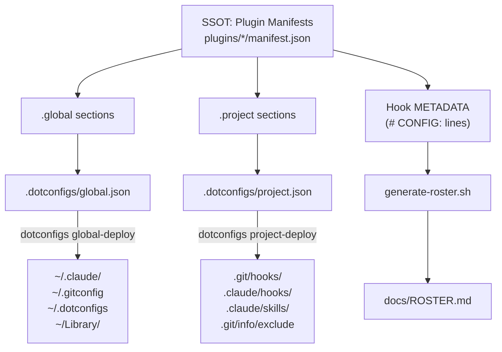

# Architecture

[← docs](../README.md#documentation) · Explanation

How dotconfigs is wired: one source of truth (plugin manifests), everything else derived, and a per-file ownership model that lets it share directories with other tools safely.

## Single source of truth

Plugin manifests (`plugins/*/manifest.json`) declare all available functionality - what files exist and where they deploy. Everything downstream derives from them:

- **Manifests** - the upstream SSOT for each plugin.
- **`.dotconfigs/global.json`** / **`.dotconfigs/project.json`** - assembled from manifests; your editable include/exclude lists controlling what's *actually* deployed.
- **Hook METADATA** (`# CONFIG:` lines in hook files) - the SSOT for hook descriptions and config keys.
- **`generate-roster.sh`** - reads manifests + hook METADATA to produce [ROSTER.md](ROSTER.md).



Each manifest declares modules with `source`, `target`, `method`, and `include`/`exclude` lists - see [Manifest format](manifest.md).

## Data flow

```
  First-time setup
  ─────────────────────────────────────────────────────────────────
  1. dotconfigs setup          creates PATH symlinks (dotconfigs, dots)
  2. dotconfigs global-init    scaffolds .dotconfigs/global.json from manifests
  3. dotconfigs global-deploy  reads global.json; deploys each module to its target
                               (conflict resolution: overwrite / skip / backup / diff)

  Per-project setup
  ─────────────────────────────────────────────────────────────────
  4. dotconfigs project-init <path>   assembles .dotconfigs/project.json; seeds .git/info/exclude
  5. (optional) edit project.json exclude lists, e.g. exclude: ["prepare-commit-msg"]
  6. dotconfigs project-deploy <path> deploys per project.json, respecting include/exclude
```

Commands and flags in full: [Commands](commands.md).

## Symlink ownership

dotconfigs tracks ownership **per file** (not per directory) by resolving each target. This is what lets it live safely in shared directories like `~/.claude/` alongside files other tools create.

```
  ~/.claude/
  ├── hooks/
  │   ├── block-rm-rf-root.sh  ──→ dotconfigs/plugins/claude/hooks/...  (ours)
  │   └── some-other-hook.sh   ──→ /other/tool/...               (foreign, untouched)
  └── skills/
      ├── commit/              ──→ dotconfigs/plugins/claude/skills/... (ours)
      └── other-skill/         ──→ /other/tool/...               (foreign, untouched)
```

Deploy only touches files it owns (symlinks resolving back into the dotconfigs repo). Foreign files are never overwritten without prompting. Files that an application *writes into* (like Claude Code's `settings.json`) are a special case handled by the `merge` method rather than symlinking - see [Deploy methods](deploy-methods.md).

## Why a clone, not a package

dotconfigs deploys symlinks that point **into the repo**, and you edit those files and commit them. That requires the repo to live on disk as an editable git clone (the same model as GNU Stow, chezmoi, yadm) - it is intentionally not a `pip`/`uv`-installed package.

## Related

- [Deploy methods](deploy-methods.md) - the four methods and when each applies.
- [Manifest format](manifest.md) - the schema the dataflow is built on.
- [Commands](commands.md) - the verbs that drive the flow.
